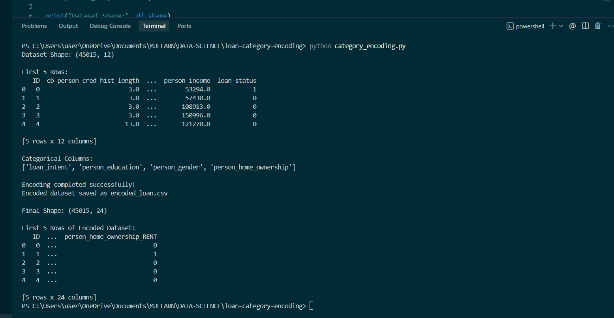
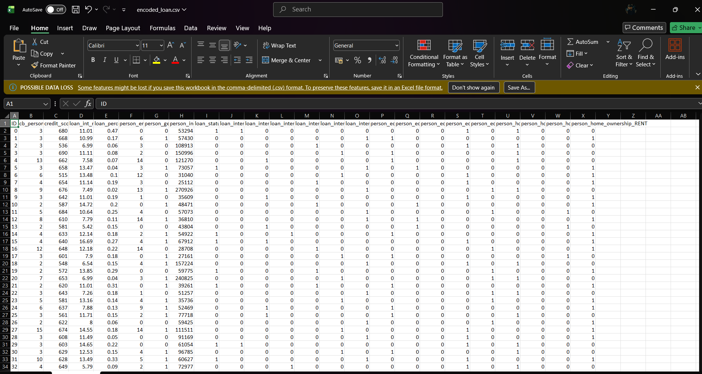

# Category Encoding using Pandas

## Overview

This project demonstrates how to convert categorical variables into numerical values using only Pandas. The loan dataset is preprocessed using Label Encoding and One-Hot Encoding techniques to prepare it for machine learning applications.

## Dataset

Dataset used: `loan.csv`

The dataset contains loan applicant information such as demographics, financial details, loan characteristics, and loan approval status.

## Objective

- Load the dataset using Pandas
- Identify categorical columns
- Convert categorical variables into numerical values
- Perform all preprocessing using only Pandas
- Generate an encoded dataset ready for machine learning

## Technologies Used

- Python
- Pandas

## Project Structure

```text
loan-category-encoding-pandas/
│
├── loan.csv
├── encoded_loan.csv
├── category_encoding.py
├── requirements.txt
├── README.md
└── screenshots/
    ├── terminal_output.png
    └── encoded_dataset.png
```

## Categorical Columns Detected

The following categorical columns were identified and encoded:

- loan_intent
- person_education
- person_gender
- person_home_ownership

## Encoding Methods

### Label Encoding

Binary categorical values are converted into numerical codes.

Example:

| Gender | Encoded |
|----------|----------|
| Male | 1 |
| Female | 0 |

### One-Hot Encoding

Multi-category columns are converted into separate binary columns.

Example:

| loan_intent |
|-------------|
| EDUCATION |
| PERSONAL |
| MEDICAL |

Becomes:

| EDUCATION | PERSONAL | MEDICAL |
|------------|------------|------------|
| 1 | 0 | 0 |
| 0 | 1 | 0 |
| 0 | 0 | 1 |

## Implementation

The Python script performs the following steps:

1. Loads the dataset
2. Detects categorical columns automatically
3. Applies Label Encoding to binary categories
4. Applies One-Hot Encoding to multi-category columns
5. Saves the transformed dataset

## How to Run

### Install Dependencies

```bash
pip install -r requirements.txt
```

### Run the Script

```bash
python category_encoding.py
```

## Output

```text
Dataset Shape: (45015, 12)

Categorical Columns:
['loan_intent',
 'person_education',
 'person_gender',
 'person_home_ownership']

Encoding completed successfully!

Encoded dataset saved as encoded_loan.csv

Final Shape: (45015, 24)
```

## Encoded Dataset

The processed dataset is saved as:

```text
encoded_loan.csv
```

All categorical values are converted into numeric values (0 and 1), making the dataset suitable for machine learning algorithms.

## Screenshots

### Terminal Output



### Encoded Dataset



## Learning Outcomes

- Data preprocessing with Pandas
- Identifying categorical features
- Label Encoding
- One-Hot Encoding
- Feature transformation for machine learning
- Exporting processed datasets

